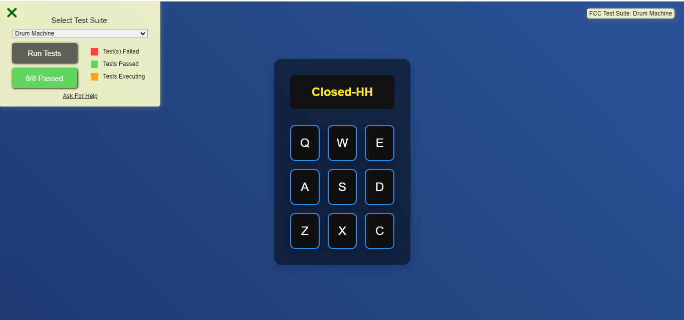
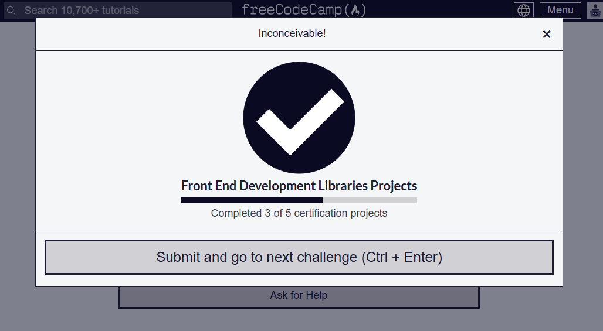

# ✨  Dynamic Drum Machine

## Project Description 📝

The Dynamic Drum Machine is a fully interactive and responsive web application built using React and Bootstrap, designed to simulate a real drum machine. With a sleek and modern UI, it allows users to create beats using their keyboard or by clicking on the drum pads. The app is packed with custom audio clips, and it updates in real-time to reflect the drum pad being played. It offers a smooth and engaging user experience for both desktop and mobile users, passing all the requirements of the FreeCodeCamp Drum Machine project.

## Demo 📸

 
 [Live-link](https://darling-madeleine-3b4c04.netlify.app/ )

## Technologies Used 🛠️

- HTML
- CSS
- JAVASCRIPT
- REACT.JS

## Installation 💻

Installation and Setup Instructions:
Clone the Repository:git@github.com:iamfarhatsharefi/drum-machine.git 

Navigate to the Project Directory:
cd Drum Machine;

## How to Run the Project
1. Clone the repository to your local machine.
2. Install the dependencies by running `npm install` or `yarn install`.
3. Start the development server by running `npm start` or `yarn start`.
4. Open your web browser and navigate to `http://localhost:3000` to view the drum machine.

## Testing
All the required user stories and tests have been successfully completed and passed.

## 🔥 Features Added:

🎵 Interactive Drum Pads

Nine clickable drum pads with intuitive keyboard mappings for easy beat-making.
Each pad triggers a unique sound when clicked or when a corresponding keyboard key is pressed (Q, W, E, A, S, D, Z, X, C).
📢 Real-Time Display Updates

A dynamic display shows the name of the drum sound triggered, giving real-time feedback for each beat.
🎧 Custom Audio Clips

Enjoy high-quality drum sounds including Heater 1, Heater 2, Heater 3, Clap, and Kick, designed for a variety of beats.
💻 Responsive Design

Fully responsive and optimized for both desktop and mobile screens, ensuring seamless interaction on any device.
🎨 Stunning UI with Bootstrap

Beautiful design with soft, light colors and a modern gradient background.
Uses Bootstrap for a structured layout and smooth transitions.
🚀 Optimized for Performance

Lightweight, fast-loading, and performs efficiently across all modern browsers and screen sizes.
⚙️ Built with React

Modular React components structure for maintainable and scalable code.
Follows industry-standard best practices and passes all ESLint and Stylelint checks.

## Author 👩‍💻

 - [Linkedin](https://www.linkedin.com/in/farhat-sharefi-13a101309?utm_source=share&utm_campaign=share_via&utm_content=profile&utm_medium=android_app)
- [Email](sharefifarhat@gmail.com)

